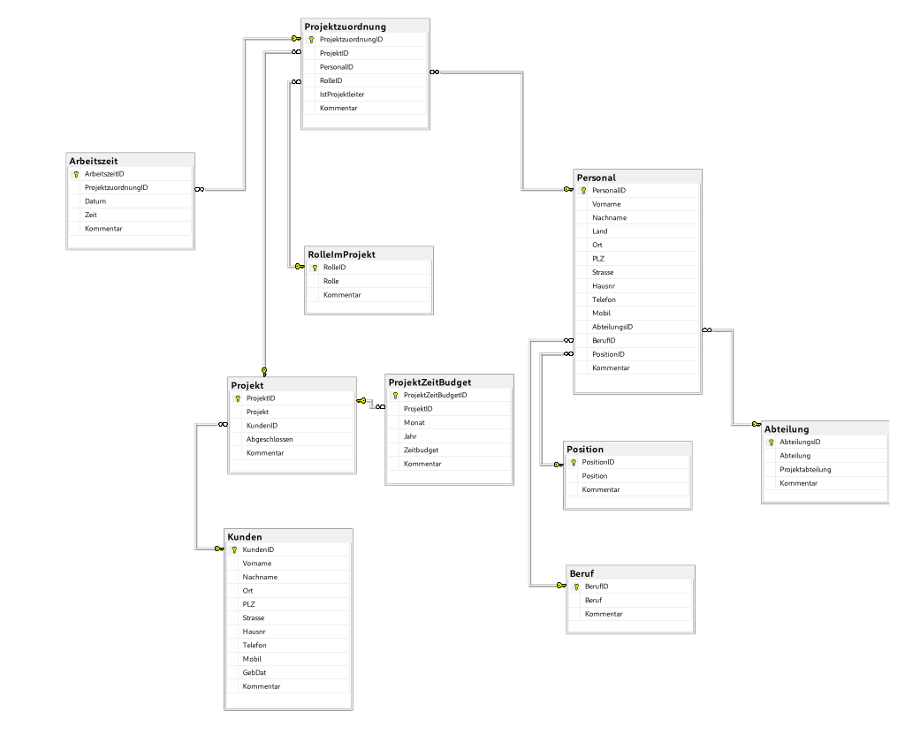

# Firma Database Management System (SQL Server)

This project is a comprehensive database management system for a corporate environment (**Firma**), developed using **T-SQL** and based on **SQL Server 2022**. It covers Human Resources, Customer Management, and Project Budgeting.

Dieses Projekt ist ein umfassendes Datenbankmanagementsystem für ein Unternehmen (**Firma**), entwickelt mit **T-SQL** auf Basis von **SQL Server 2022**. Es deckt die Bereiche Personalwesen, Kundenmanagement und Projektbudgetierung ab.

---

## Key Features | Hauptmerkmale

### 🇬🇧 English
* **HR Management:** Full table structure for personnel, departments, job positions, and skills.
* **Time Tracking:** Management of employee project assignments and precise labor hour tracking.
* **Project Budgeting:** Advanced functions for calculating and controlling monthly project time budgets.
* **Audit Logging:** Intelligent triggers for automatic change tracking in personnel and customer tables to ensure data integrity.
* **Advanced Reporting:** A detailed set of Functions, Views, and Stored Procedures for performance analysis.

### 🇩🇪 Deutsch
* **Personalverwaltung:** Vollständige Tabellenstruktur für Personal, Abteilungen, Positionen und Qualifikationen.
* **Zeiterfassung:** Verwaltung von Projektzuordnungen und präzise Erfassung der Arbeitsstunden.
* **Projekt-Budgetierung:** Fortgeschrittene Funktionen zur Berechnung und Kontrolle monatlicher Zeitbudgets.
* **Audit-Logging:** Intelligente Trigger zur automatischen Erfassung von Änderungen in Personal- und Kundentabellen zur Datensicherheit.
* **Reporting:** Ein detailliertes Set an Funktionen, Views und Stored Procedures zur Performance-Analyse.

---

## Data Model | Datenmodell

### 🇬🇧 English
The relational schema includes **One-to-Many** and **Many-to-Many** relationships optimized for query performance. Below is the visual representation of the database:

### 🇩🇪 Deutsch
Das relationale Schema umfasst **One-to-Many** und **Many-to-Many** Beziehungen, die für die Abfrageleistung optimiert sind. Unten finden Sie die visuelle Darstellung der Datenbank:

---

## Technology Stack | Technologien

- **RDBMS:** Microsoft SQL Server 2022
- **Language:** T-SQL (Transact-SQL)
- **Compatibility Level:** 160

---

## 📂 Repository Content | Inhalt

- `Firma_FullSetup.sql`: Full script for tables, relations, functions, triggers, and seed data.
- `Firma_Diagramm.pdf`: The complete ER Diagram of the project.
- `images/`: Contains visual documentation of the database schema.

---

## Installation | Installation

### 🇬🇧 English
1. Open `Firma_FullSetup.sql` in **SSMS** (SQL Server Management Studio).
2. Ensure you have permissions to create a database.
3. Press `F5` to execute the script. The database, schema, and sample data will be created automatically.

### 🇩🇪 Deutsch
1. Öffnen Sie `Firma_FullSetup.sql` in **SSMS**.
2. Stellen Sie sicher, dass Sie über die Berechtigungen zum Erstellen einer Datenbank verfügen.
3. Drücken Sie `F5`, um das Skript auszuführen. Die Datenbank, das Schema und die Beispieldaten werden automatisch erstellt.

---
**Author:** Siamak Goudarzi 
